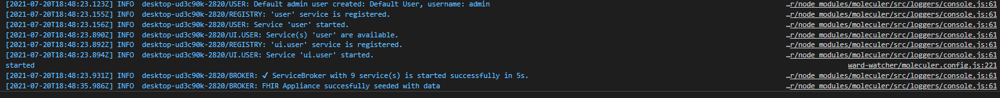

# Ward Watcher

A simple web based application that uses FHIR resources to display information about current inpatients at a fictional NHS trust (a very basic bed state). Encounter resources are created from HL7v2 ADT messages.

## Contents

[Prerequisites](#prequisites)

[Debug Settings](#debug-settings)

[Run the app](#run-the-app)

[View the code](#view-the-code)

[Launch Mirth Connect](#launch-mirth-connect)

## Prerequisites

[Node.js](https://nodejs.org/en/)

[Docker Desktop](https://www.docker.com/products/docker-desktop)

[Docker Compose](https://docs.docker.com/compose/install/)

[VS Code](https://code.visualstudio.com/)

[Java](https://www.java.com/en/download/manual.jsp/) (for the Mirth Connect client - this is optional)

## Debug Settings

It is necessary to create a `debug.env` file if you want to run the app using VS Code debug. To create a debug file:

1. Create a new empty text file called `debug.env` in `launch/app/`

2. Add each of the following settings on a new line

| Setting Key | Setting Value |
| :----------------- | :--- |
| TZ            | utc |
| LOG_LEVEL            | debug |
| METRICS_ENABLED            | true |
| TRACING_ENABLED             | false |
| APP_NAME             | ward_watcher |
| APP_LAUNCH_FHIR_SERVER_REPO | https://github.com/synanetics/fhir-appliance-example-applications/ward-watcher
| APP_NHS_ORGANIZATION_ODS_CODE | ZZ1
| APP_TZ | Europe/London
| APP_LOG_REQUEST_PARAMS | debug
| APP_LOG_RESPONSE_DATA | debug
| APP_UI_GATEWAY_TRANSPORT_PROTOCOL | http
| APP_UI_GATEWAY_TRANSPORT_PORT | 3000
| APP_UI_SESSION_COOKIE_SECURE | false
| APP_DATABASE_DIALECT | mssql
| APP_DATABASE_PORT | 1434
| APP_DATABASE_DATABASE_NAME | WARDWATCHER
| APP_DATABASE_USERNAME | ward_watcher
| APP_DATABASE_PASSWORD | 5tMunG050nFh1R
| APP_FHIR_APPLIANCE_HOST | https://localhost
| APP_FHIR_APPLIANCE_PORT | 3443
| APP_FHIR_APPLIANCE_PATH | fhir/stu3
| APP_FHIR_APPLIANCE_AUTH_JWT_SIGNING_KEY | ./launch/app/auth/jwt.signing.key.pem
| APP_FHIR_APPLIANCE_AUTH_MUTAL_TLS_CLIENT_CERTIFICATE | ./launch/app/auth/fhir.appliance.local.client.cert.pem
| APP_FHIR_APPLIANCE_AUTH_MUTAL_TLS_CLIENT_CERTIFICATE_KEY | ./launch/app/auth/fhir.appliance.local.client.key.pem
| APP_FHIR_APPLIANCE_AUTH_MUTAL_TLS_CLIENT_ROOT_CA | ./launch/app/auth/fhir.appliance.root.ca.pem

You can refer to the .env file located under `/ward-watcher` for reference.

> Keys and certificates are self signed and cannot be used outside of the application. Passwords provided are not used outside of the application. You can change passwords as required - passwords provided are for convenience.

## Run the app

Once you have the prerequisites installed and have created a [debug.env](#debug-settings) :

1. Download and extract the [FHIR Appliance Example Applications](https://github.com/synanetics/fhir-appliance-example-applications/archive/refs/heads/master.zip) repository to a directory on your local machine.

2. Open the Visual Studio Code and from the `File` top menu option select `Open Folder...`

3. Navigate to the location where you downloaded the repository in step 1.

4. From the `RUN AND DEBUG` tool bar (located in the top left side of the screen under the top menu bar), click the green run button. After a minute or so, the application and all backend services will be available. You should see the following when the app is up and running:

5. Launch the app in your browser using [http://localhost:3000/](http://localhost:3000/) 

> The application will create a default user during startup and you can login using the following credentials u: `admin` p: `admin`. 

## View the code

1. All the source code for the app is under the `ward-watcher` folder.

## Launch Mirth Connect

The Ward Watcher bundles an integration engine so that is possible to alter the bed state using ADT A01, A02 and A03 messages. To try this out:

1. Launch the Mirth Connect web interface using [http://localhost:8080](http://localhost:8080)

2. On the resultant screen, click the `Download Administrator Installer` and follow the instructions, accepting the defaults and choose to run the administrator at the end of the installation.

3. In the `Mirth Administrator Launcher` window, hit the `Launch` button.

4. When prompted, login to Mirth using the default user u: `admin` p: `admin`

5. Complete the user information form (you don't have to register) and you will eventually be presented with the Mirth Connect Administrator.

6. Click `Channels` from the upper left hand side of the screen (under the Mirth Connect menu). This will open the channels screen.

7. Under the left hand menu titled `Group Tasks` click the `Import Group` button.

8. From the file browser window navigate to the folder/directory where you unzipped the FHIR Appliance Example Applications repository and select the file called `ADT.xml` file in the `/ward-watcher/launch/mirth/channels` folder. Click `Open` followed by `Import` in the resultant screens to import the interface.

9. Right click the `ADT` group that appears in the channel list and select `Deploy Channel`. You will be taken back to the main dashboard screen where you can see all running channels.

10. Right click the `ADT to FHIR` channel in the dashboard and select `Send Message`

11. Click the `Open Text File...` button and navigate to folder/directory where you unzipped the FHIR Appliance Example Applications repository.

12. Select the file called `test-patient-TOTHILL-a01.hl7` in the `/ward-watcher/launch/mirth/hl7v2` folder. Click `Open` to load the file contents in the message window.

13. Finally, click the `Process Message` button at the bottom of the message window to send the message.